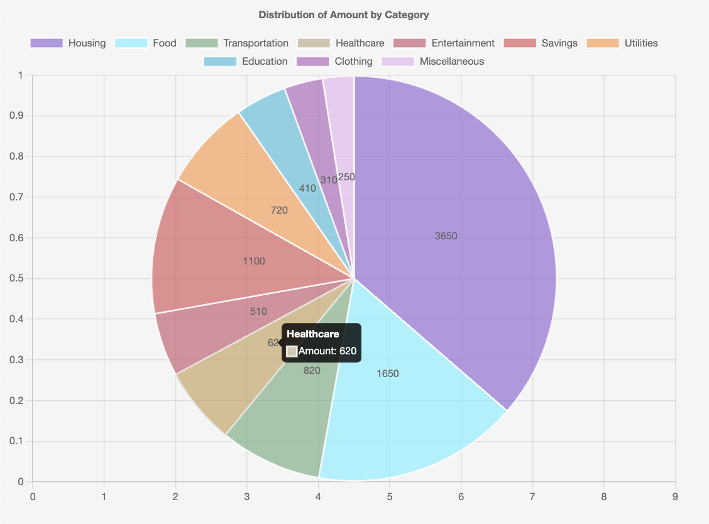

# Pie Charts

Pie charts are useful for showing proportional parts of a whole. They display data as slices of a circle with sizes proportional to their values. Chart Gizmo's pie charts are built on [Chart.js Pie and Doughnut Charts](https://www.chartjs.org/docs/latest/charts/doughnut.html).

<div style="display: flex; justify-content: center; gap: 20px;">
    
    
</div>

## Basic Usage

```python
from chart_gizmo.pie import PieChart
from H5Gizmos import serve

# Create a new pie chart
chart = PieChart(width=600, height=400)

# Add labels for each slice
for fruit in ["Apples", "Oranges", "Bananas", "Grapes", "Kiwi"]:
    chart.add_label(fruit)

# Add data with colors
chart.add_data_values(
    "Fruits",
    [45, 25, 15, 10, 5],
    background_color=[
        "rgba(255, 99, 132, 0.7)",
        "rgba(54, 162, 235, 0.7)",
        "rgba(255, 206, 86, 0.7)",
        "rgba(75, 192, 192, 0.7)",
        "rgba(153, 102, 255, 0.7)"
    ],
    border_color="rgba(255, 255, 255, 0.8)"
)

# Display the chart
serve(chart.show())
```

## Donut Charts

You can convert a pie chart to a donut chart using the `as_donut()` method:

```python
from chart_gizmo.pie import PieChart
from H5Gizmos import serve

# Create a new chart and convert to donut
chart = PieChart(width=600, height=400)
chart.as_donut(0.6)  # Hole size is 60% of the radius

# Add labels and data
for category in ["Housing", "Food", "Transport", "Entertainment", "Savings"]:
    chart.add_label(category)

chart.add_data_values(
    "Budget",
    [35, 25, 15, 10, 15],
    background_color=[
        "rgba(255, 99, 132, 0.7)",
        "rgba(54, 162, 235, 0.7)",
        "rgba(255, 206, 86, 0.7)",
        "rgba(75, 192, 192, 0.7)",
        "rgba(153, 102, 255, 0.7)"
    ]
)

# Display the chart
serve(chart.show())
```

## Creating Pie Charts from CSV

You can easily create pie charts from CSV files using the `CSVPieChart` class:

```python
from chart_gizmo.pie import CSVPieChart
from H5Gizmos import serve

# Create chart from CSV, specifying label and value columns
chart = CSVPieChart(
    csv_file="data/data.csv",
    label_column="Country",
    value_column="Population",
    width=800,
    height=600
)

# Display the chart
serve(chart.show())
```

## API Reference

### PieChart

```python
PieChart(configuration=None, width=400, height=400, donut=False, donut_ratio=0.5, options=None)
```

### Constructor Parameters:

-   `configuration`: Optional chart configuration
-   `width` (int): Chart width in pixels (default: 400)
-   `height` (int): Chart height in pixels (default: 400)
-   `title` (str): Chart title
-   `donut` (bool): Whether to render the chart as a donut chart
-   `donut_ratio` (float): Ratio of the donut hole size (0-1)
-   `animate` (bool): Enable or disable animations. Default is `False` (no animation). Controlled by the symbolic constant `ANIMATION_DEFAULT`.
-   `on_click_call(callback, action='click', selection='nearest')`: Set a callback function for click events on the chart. See [OnClick Event Example](../examples/#onclick-event-example).

### Methods:

-   `add_label(label)`: Add a slice label to the chart
-   `add_data_values(label, values, background_color, border_color, border_width)`: Add data values with colors
-   `as_donut(ratio)`: Convert to a donut chart with the specified hole ratio
-   `show()`: Returns a gizmo for display
-   `saveImage(filepath)`: Asynchronous method to save the chart as a PNG image file. Must be awaited when called. See [Chart Image Export Example](../examples/#chart-image-export).

### CSVPieChart

```python
CSVPieChart(csv_file, label_column=None, value_column=None, width=400, height=400, donut=False, donut_ratio=0.5, configuration=None, options=None)
```

### Constructor Parameters:

-   `csv_file`: Path to the CSV file
-   `label_column`: Name of the column to use for slice labels
-   `value_column`: Name of the column to use for slice values
-   `width`: Chart width in pixels
-   `height`: Chart height in pixels
-   `donut`: If True, creates a donut chart
-   `donut_ratio`: The size of the hole in a donut chart (0-1)
-   `configuration`: Optional chart configuration
-   `options`: Additional Chart.js options
-   `animate` (bool): Enable or disable animations. Default is `False` (no animation). Controlled by the symbolic constant `ANIMATION_DEFAULT`.
-   `on_click_call(callback, action='click', selection='nearest')`: Set a callback function for click events on the chart. See [OnClick Event Example](../examples/#onclick-event-example).

### Command-line Script

-   `CSVPieChartScript()`: Command-line entrypoint for CSVPieChart.

See the [Pie Chart CLI documentation](../cli/pie.md) for detailed usage instructions on the command-line tool.

### Description

A class to represent a pie chart. Inherits from [`AbstractChart`](../api/charts.md).
