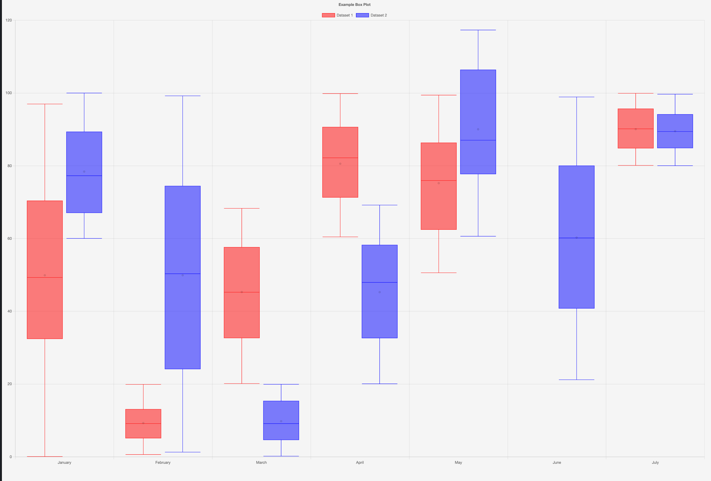

# Box Plot Chart CLI

The `boxplot-gizmo` command-line tool allows you to quickly create boxplot charts from CSV data files. It's based on the [BoxPlotChart API](../api/boxplot.md).



## Basic Usage

```bash
boxplot-gizmo data/data.csv --columns "Amount,Score"
```

This creates a boxplot for the "Amount" and "Score" columns in the CSV file.

## Grouped Boxplot Example

```bash
boxplot-gizmo data/data.csv --columns "Amount,Score" -g "Year"
```

This creates a grouped boxplot, grouping by the "Year" column.

## Real-World Example: State Population by Year

```bash
boxplot-gizmo historical_state_population_by_year.csv --columns "Population" -g "Year" --title "State Population Distribution by Year" --animate
```

## All Options

-   `--columns`: Comma-separated list of columns to include as boxes (default: all except group column)
-   `-g`: Name of the column to group by (optional)
-   `-l`: Comma-separated list of labels for the x-axis (optional)
-   `--title`: Chart title (optional)
-   `--width`: Chart width in pixels (default: 600)
-   `--height`: Chart height in pixels (default: 400)
-   `--animate`: Enable animations (default: no animation)

## More Examples

### Simple Boxplot

```bash
boxplot-gizmo data/data.csv --columns "Amount"
```

### Grouped by Category

```bash
boxplot-gizmo data/data.csv --columns "Amount" -g "Category"
```

## See Also

-   [BoxPlotChart API](../api/boxplot.md)
-   [Other CLI Tools](index.md)
