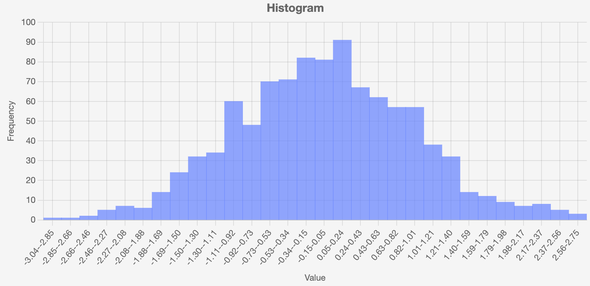

# Histogram CLI

The `histogram-gizmo` command-line tool allows you to create histograms from data files containing numerical values. It's based on the [HistogramBarChart API](../api/histogram.md).



## Basic Usage

```bash
histogram-gizmo data_file.txt
```

This will create a histogram from a text file containing numbers (one per line).

## Examples

### Basic Histogram with Default Settings

```bash
histogram-gizmo data/sample_10000.txt
```

### Customize the Number of Bins

```bash
histogram-gizmo data/sample_10000.txt -b 20
histogram-gizmo data/sample_10000.txt -b 50
```

### Create a Density Plot

```bash
histogram-gizmo data/sample_10000.txt -d
```

### Focus on a Specific Range

```bash
histogram-gizmo data/sample_10000.txt -r 30 70
```

### Change Chart Dimensions

```bash
histogram-gizmo data/sample_10000.txt -w 1200 --height 700
```

### Add Title and Axis Labels

```bash
histogram-gizmo data/sample_10000.txt --title "Distribution" --x-label "Value" --y-label "Frequency"
```

### Combined Options

```bash
histogram-gizmo data/sample_10000.txt -b 50 -d -r 20 80 --title "Sample Data Distribution" -w 1000 --height 600 --x-label "Sample Values" --y-label "Probability Density"
```

### Read NumPy File

```bash
histogram-gizmo data/perfect_normal.npy
```

### Enable Animations

```bash
histogram-gizmo data/sample_10000.txt --animate
```

## All Options

-   `-b`, `--bins`: Number of bins for the histogram (default: 30)
-   `-d`, `--density`: Create a density plot instead of frequency count (default: False)
-   `-r`, `--range`: Range of values to include as "min max" (e.g., "30 70")
-   `-w`, `--width`: Width of chart in pixels
-   `--height`: Height of chart in pixels
-   `--title`: Chart title
-   `--x-label`: Label for x-axis
-   `--y-label`: Label for y-axis
-   `--animate`: Enable animations (default: no animation)
