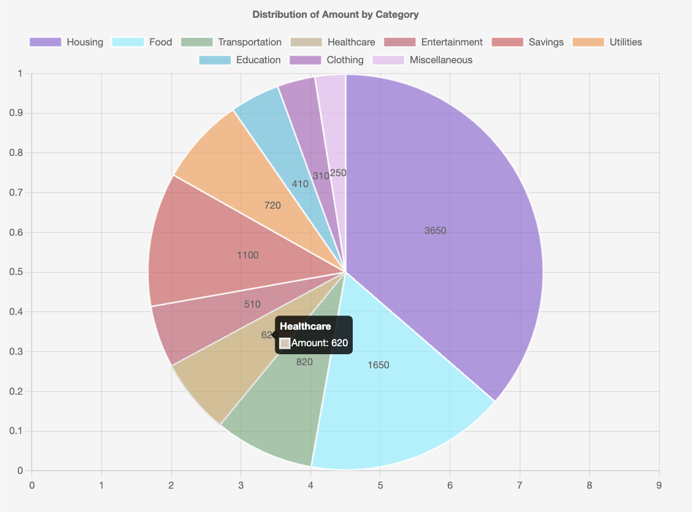
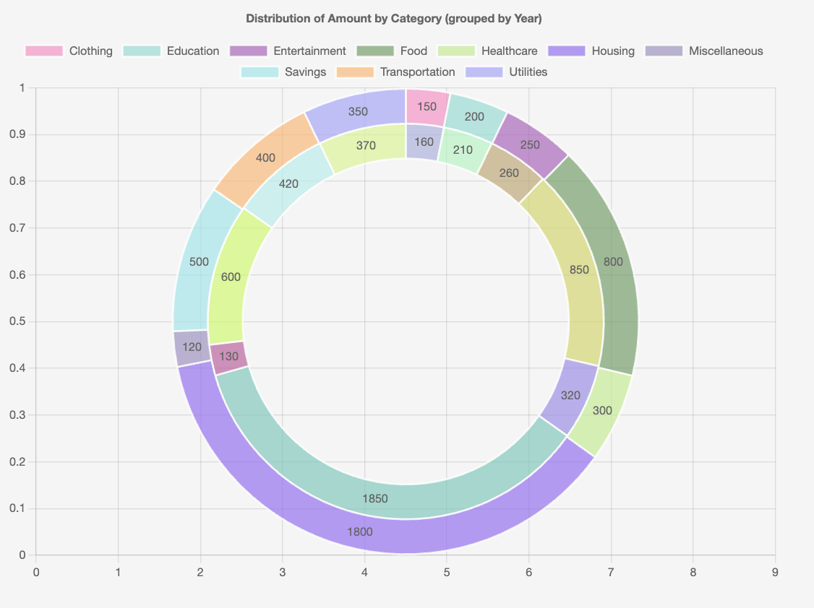

# Pie Chart CLI

The `csv-pie-gizmo` command-line tool allows you to quickly create pie and donut charts from CSV data files. It's based on the [PieChart API](../api/pie.md).

<div style="display: flex; justify-content: center; gap: 20px;">
    
    
</div>

## Basic Usage

```bash
csv-pie-gizmo data.csv -l "Category" -v "Amount"
```

This will create a pie chart from the CSV file, using the "Category" column for slice labels and the "Amount" column for slice values.

## Examples

### Simple Pie Chart

```bash
csv-pie-gizmo data/data.csv -l "Category" -v "Amount" --width 800 --height 600
```

### Donut Chart

```bash
csv-pie-gizmo data/data.csv -l "Category" -v "Amount" --donut
```

### Donut Chart with Custom Ratio

```bash
csv-pie-gizmo data/data.csv -l "Category" -v "Amount" --donut --donut-ratio 0.7 --width 800 --height 600
```

### Grouped Pie Chart by Year

```bash
csv-pie-gizmo data/data.csv -l "Category" -v "Amount" -g "Year"
```

### Complex Example

```bash
csv-pie-gizmo life1999.csv -l "Disaggregation" -v "Value" --width 900 --height 700 --donut --donut-ratio 0.6 --title "Life Expectancy Distribution"
```

## All Options

-   `-l`: Column name for slice labels
-   `-v`: Column name for slice values
-   `-g`: Column name for grouping data into multiple datasets
-   `-w`, `--width`: Width of chart in pixels
-   `-H`, `--height`: Height of chart in pixels
-   `--donut`: Create a donut chart instead of a pie chart
-   `--donut-ratio`: Size of the donut hole (0.0-1.0, default: 0.5)
-   `--title`: Chart title
-   `--animate`: Enable animations (default: no animation)
